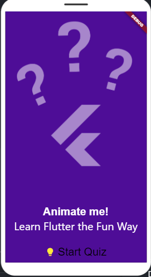

# FlutterQuizApp

  

---

Welcome to FlutterQuizApp, your go-to solution for engaging quizzes on the fly! Whether you're a trivia enthusiast, an educator looking to gamify learning, or a developer eager to contribute, this Flutter-based quiz application has you covered.

## Key Features

- **Seamless User Experience**: Navigate effortlessly through an elegant and intuitive interface designed with the end-user in mind.
- **Diverse Quiz Formats**: From multiple-choice to open-ended questions, we've got the versatility to suit every quizzer's preference.
- **Tailored Quizzes**: Customize quizzes to your heart's content by adding, editing, or removing questions and answers effortlessly.
- **Real-Time Feedback**: Stay motivated with instant scoring and feedback upon completing each quiz.
- **Friendly Competition**: Climb the leaderboard and compare your scores with fellow quiz enthusiasts for that extra dash of excitement.
- **Anytime, Anywhere Access**: Enjoy uninterrupted quiz sessions even without an internet connection, perfect for on-the-go learning.
- **Enhanced Readability**: Switch seamlessly between light and dark modes for optimal viewing comfort in any environment.
- **Inclusive Accessibility**: We believe everyone should have access to knowledge. That's why our app includes features like text-to-speech support and adjustable font sizes.
- **Responsive Design**: Experience the same seamless performance across devices, from smartphones to tablets.

---

## Getting Started

1. **Clone the Repository**: Start by cloning this repository to your local machine using `git clone https://github.com/sudiptakrsarkarai/flutter_quiz_app`.
2. **Navigate to the Project Directory**: Once cloned, navigate to the project directory using `cd flutter_quiz_app`.
3. **Install Dependencies**: Run `flutter pub get` to install all the necessary dependencies.
4. **Launch the App**: Connect your device or start an emulator/simulator, then run `flutter run` to launch the application.

---

## Contributions Welcome!

We believe in the power of community-driven development. If you have ideas for new features, spot a bug, or simply want to lend a hand, don't hesitate to get involved!

## License

This project is licensed under the MIT License. For details, see the [LICENSE](LICENSE) file.

---

  Crafted with passion by [Sudipta Kumar Sarkar](https://github.com/sudiptakrsarkarai)

